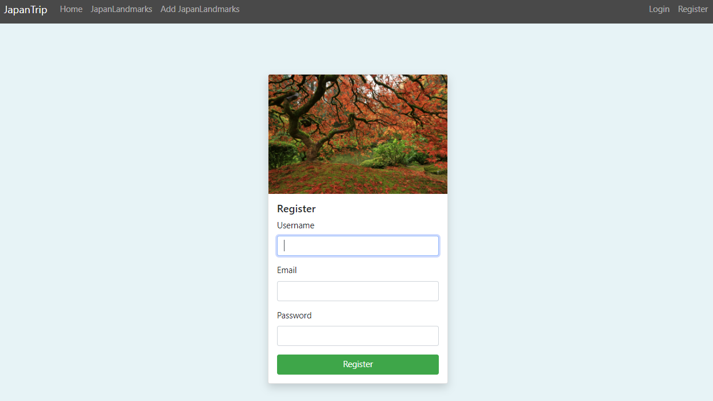

# **JapanTrip: Explore Japan's Landmarks**


JapanTrip is a web application designed to help users explore and discover various landmarks and destinations in Japan. With integrated user authentication and authorization, users can securely add, edit, and delete landmarks and comments, ensuring a personalized and interactive experience. Leveraging modern web technologies and frameworks, JapanTrip provides an intuitive platform for users to engage with Japan's rich cultural and natural heritage.

## **Key Features**

- **User Authentication and Authorization**: JapanTrip integrates a robust user authentication and authorization system, ensuring secure access to adding, editing, and deleting landmarks and comments. Leveraging **Passport.js** middleware, users can authenticate securely, and access is restricted to respective post owners.
- **Database Management**: Utilizing **MongoDB** for efficient storage and retrieval of user data and application content, JapanTrip ensures seamless management of data. MongoDB's flexibility and scalability make it ideal for handling user-related information and application content.
- **Dynamic Image Management**: Integration with **Cloudinary** enables dynamic management of images associated with landmarks and destinations. Users can seamlessly upload and display images, enhancing the visual experience and providing additional context to each landmark.
- **Mapping Functionalities**: Incorporating **Mapbox** enhances the user experience with visible and accurate mapping functionalities. Users can navigate and explore destinations visually, gaining insights into the geographical context of each landmark.
- **Real-time Feedback**: **Flash** messaging provides users with real-time feedback on their actions, enhancing usability and guiding users through the application's functionalities. Whether it's a successful action or an error, users are informed promptly, ensuring a smooth user experience.
- **Streamlined Schema Validation**: **Joi** is utilized for streamlined schema validation, ensuring data integrity and facilitating easier maintenance of the application's data structure. By validating input data against predefined schemas, JapanTrip ensures consistency and reliability of user-submitted information.

## **Technologies Used**

- **Node.js**: Backend runtime environment
- **Express.js**: Web application framework for Node.js
- **MongoDB**: NoSQL database for efficient data storage
- **Mongoose**: MongoDB object modeling for Node.js
- **Passport.js**: Authentication middleware for Node.js
- **EJS**: Embedded JavaScript templating for frontend rendering
- **Bootstrap**: Frontend framework for responsive design
- **Mapbox**: Mapping platform for interactive maps
- **Cloudinary**: Cloud-based image management platform
- **Joi**: Schema validation library for JavaScript

## Views

- **home.ejs**: Homepage of the application, providing links to explore landmarks, login, and register
- **show.ejs**: Displays all landmarks in Japan with images and brief descriptions. Users can click on a landmark to view more details.


- **details.ejs**: Provides detailed information about a specific landmark, including its title, description, location, and reviews from other users. Authenticated users can leave reviews, edit the landmark, or delete it if they are the creator.


- **edit.ejs**: Allows authenticated users to edit existing landmarks. Users can modify the title, location, price, descriptor, description, and upload additional images.


- **new.ejs**: Enables authenticated users to add new landmarks to the platform. Users can input the title, location, price, descriptor, description, and upload images for the new landmark.


- **users/login.ejs**: Displays a login form for users to access their accounts.


- **users/register.ejs**: Allows new users to register for an account.



- **layouts/boilerplate.ejs**: Boilerplate layout template shared across multiple views, containing header, footer, and navigation elements.
- **partials/flash.ejs**: Partial template for displaying success and error messages.
- **partials/navbar.ejs**: Partial template for the navigation bar displayed at the top of each page.
- **partials/footer.ejs**: Partial template for the footer displayed at the bottom of each page.
- **error.ejs**: Displays error messages, including the error message and stack trace (in development mode)..

## Utils

**catchAsync.js:**

```jsx
module.exports = func =>{
    return(req, res, next) =>{
        func(req, res, next).catch(next);
    }
}
```

Explanation: This utility function is used to wrap asynchronous route handlers to catch any errors that occur within them. It ensures that any errors are passed to the global error handler using the **`next`** function, allowing for centralized error handling in the application.

**expressError.js:**

```jsx
class expressError extends Error{
    constructor(message, statusCode){
        super();
        this.message = message;
        this.statusCode = statusCode;
    }
}
module.exports = expressError;
```

Explanation: This file defines a custom error class **`expressError`** that extends the built-in **`Error`** class. It allows for creating custom error instances with a message and status code, which can then be used for error handling in the application.

**middleware.js:**

```jsx
const ExpressError = require("../utils/expressError");
const {japanLandmarkSchema} = require("../models/schema");
const {reviewSchema} = require("../models/schema");
const JapanLandmark = require("../models/JapanLandmark");
const Review = require("../models/review");

module.exports.validateJapanLandmark = (req, res, next) =>{
    const {error} = japanLandmarkSchema.validate(req.body); // this validate is from joi
    if(error){
        const msg = error.details.map(e => e.message).join(",");
        throw new ExpressError(msg, 400);
    }else{
        next();
    }
}

module.exports.validateReview = (req, res, next) =>{
    const {error} = reviewSchema.validate(req.body); // this validate is from joi
    if(error){
        const msg = error.details.map(e => e.message).join(",");
        throw new ExpressError(msg, 400);
    }else{
        next();
    }
}

module.exports.isLoggedIn = (req, res, next) =>{
    if(!req.isAuthenticated()){ // this .isAuthenticated methods comes to req automatically by using passport-local.
        req.session.returnTo = req.originalUrl
        req.flash("error", "You must be signed in first!");
        return res.redirect("/login");
    }
    next();
}

module.exports.isAuthor = async (req, res, next) =>{
    const {id} = req.params;
    const japanLandmark = await JapanLandmark.findById(id);
    if(!japanLandmark.author.equals(req.user._id)){
        req.flash("error", "You do not have permission to do that.");
        return res.redirect(`/japanLandmark/${id}`);
    }
    next();
}

module.exports.isReviewAuthor = async (req, res, next) =>{
    const {id, reviewId} = req.params; //specify both id and reviewId - campgrounds/id/reviews/:reviewId
    const review = await Review.findById(reviewId);
    if(!review.author.equals(req.user._id)){
        req.flash("error", "You do not have permission to do that.");
        return res.redirect(`/japanLandmark/${id}`);
    }
    next();
}
```

Explanation: This file contains various middleware functions used throughout the application for validation, authentication, and authorization purposes. Here's what each function does:

- **`validateJapanLandmark`**: Validates the request body for adding or editing a Japan landmark using a predefined schema.
- **`validateReview`**: Validates the request body for adding or editing a review using a predefined schema.
- **`isLoggedIn`**: Checks if the user is authenticated. If not, it redirects them to the login page with an error message.
- **`isAuthor`**: Checks if the current user is the author of a Japan landmark. If not, it redirects them with an error message.
- **`isReviewAuthor`**: Checks if the current user is the author of a review. If not, it redirects them with an error message.

## **app.js**

The backbone of JapanTrip, **`app.js`** sets up the Express server environment and defines routes for handling user requests. Key functionalities include:

- Configuration of middleware for session management, body parsing, and method overriding.
- Integration of Passport.js for user authentication and session management.
- Definition of routes for user authentication, landmark management, and comment handling.
- Error handling middleware to manage and display errors gracefully to users.

The server listens on the specified port, and the database connection is established upon starting the server.

## **Summary**

JapanTrip offers a comprehensive platform for exploring Japan's landmarks, leveraging modern web technologies to provide users with an immersive and informative experience. With user authentication, database management, dynamic image handling, mapping functionalities, real-time feedback, and streamlined schema validation, JapanTrip ensures a seamless and engaging user experience, catering to both casual users and avid travelers interested in Japan's cultural and natural wonders.